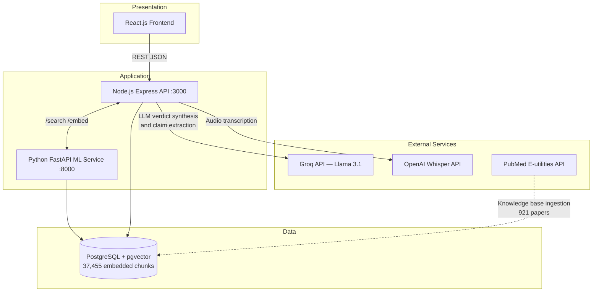
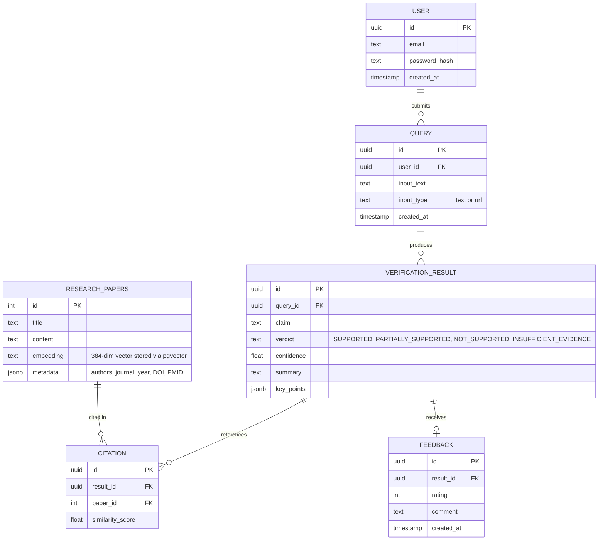
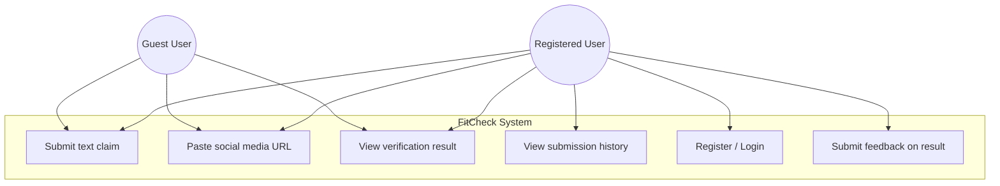
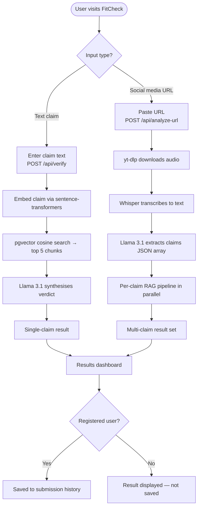
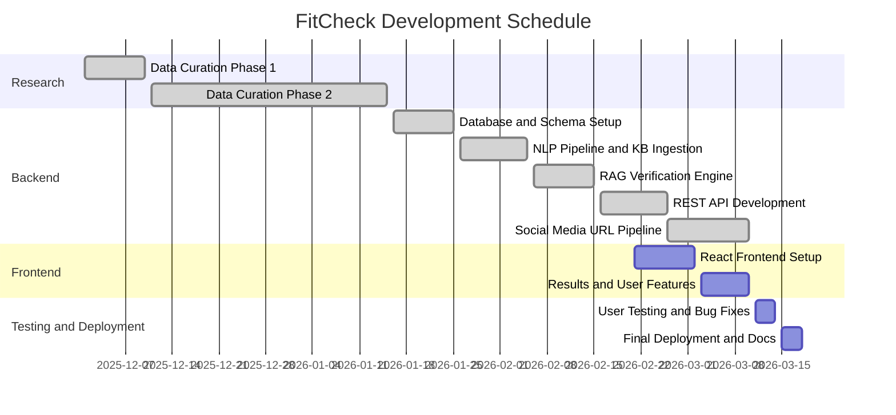

# UNIVERSITY OF NAIROBI
## FACULTY OF SCIENCE AND TECHNOLOGY
## DEPARTMENT OF COMPUTING AND INFORMATICS

---

# Fitness Misinformation Detection System Using Natural Language Processing

**BY**

**PETER KIOKO**

**P15/144253/2022**

---

A project report submitted in partial fulfillment of the requirements for the award of Bachelor of Science in Computer Science of the University of Nairobi.

**SEPTEMBER 2025**

---

## TABLE OF CONTENTS

- DECLARATION
- ABSTRACT
- ABBREVIATIONS AND ACRONYMS
- CHAPTER 1: INTRODUCTION
  - 1.4 Scope
    - 1.4.1 Functionality Scope
    - 1.4.2 Time Scope
- CHAPTER 2: REVIEW OF SIMILAR SYSTEMS
  - 2.1 Health Misinformation Detection Systems
  - 2.2 Natural Language Processing in Health Communication
  - 2.3 Exercise Science and Digital Health Information
  - 2.4 Existing Fact-Checking Platforms and Tools
  - 2.5 Literature Review
    - 2.5.1 The Global Context: Rise and Limitations of Health Tech Systems
    - 2.5.2 The Kenyan Market Gap: Digital Health Literacy Challenges
- CHAPTER 3: SYSTEM ANALYSIS AND DESIGN
  - 3.1 System Development Methodology
    - 3.1.1 Methodology Justification
    - 3.1.2 Sprint Structure
  - 3.2 System Analysis
    - 3.2.1 Stakeholder Analysis
    - 3.2.2 Current System Analysis
    - 3.2.3 Functional Requirements
    - 3.2.4 Non-functional Requirements
  - 3.3 System Design
    - 3.3.1 Architectural Design
    - 3.3.2 Process Design
    - 3.3.3 Database Design
    - 3.3.4 User Interface Designs
    - 3.3.5 Applications
    - 3.3.6 Technology
    - 3.3.7 Deployment
  - 3.4 Resources
  - 3.5 Project Schedule and Gantt Charts
  - 3.6 Project Gantt Chart
- References

---

## DECLARATION

This proposal is entirely my own original work and has not been submitted, in whole or in part, for the award of any degree or diploma at this or any other University.

………………………….
Peter Kioko
1st October 2024

---

## ABSTRACT

The rapid proliferation of health and wellness content on social media has fostered an environment where unverified exercise and nutrition claims spread unchecked, potentially leading to physical injuries and ineffective training practices among enthusiasts. While automated fact-checking tools exist, they predominantly focus on political discourse or general medical misinformation, leaving a critical gap in the detection of domain-specific fitness misinformation. This project proposes the development of an AI-Powered Fitness Misinformation Detection System designed to identify and verify such claims. The system employs a three-tier architecture comprising a React-based web interface, a Python machine learning microservice for semantic processing, and a PostgreSQL database extended with vector similarity search capabilities. The core verification pipeline is implemented as a Retrieval-Augmented Generation system, whereby claims submitted by users are transformed into semantic embeddings using the sentence-transformers all-MiniLM-L6-v2 model and compared against a knowledge base of 921 peer-reviewed fitness and nutrition papers automatically retrieved from the PubMed Central database, yielding 37,455 searchable text segments. Contextually relevant evidence is retrieved through cosine similarity search using the pgvector extension and synthesised by the Llama 3.1 large language model, accessed via the Groq inference API, into structured verdicts accompanied by confidence levels, evidence summaries, and source citations. The system additionally accepts TikTok and Instagram video URLs, from which audio is automatically extracted using the yt-dlp utility and transcribed via the OpenAI Whisper API; the transcript is then processed by the Llama 3.1 model to identify and extract individual fitness and nutrition claims, each of which is independently verified through the RAG pipeline, returning a structured multi-claim result set that reflects the full evidential content of the social media post. The successful implementation of this system aims to empower fitness enthusiasts with the tools necessary to distinguish evidence-based science from unfounded myths, ultimately contributing to safer wellness practices.

---

## ABBREVIATIONS AND ACRONYMS

| Abbreviation/Acronym | Definition |
|---|---|
| AI | Artificial Intelligence |
| API | Application Programming Interface |
| AWS | Amazon Web Services |
| BERT | Bidirectional Encoder Representations from Transformers |
| DFD | Data Flow Diagram |
| ERD | Entity-Relationship Diagram |
| LLM | Large Language Model |
| ML | Machine Learning |
| MVP | Minimum Viable Product |
| NER | Named Entity Recognition |
| NLP | Natural Language Processing |
| PMC | PubMed Central |
| RAG | Retrieval-Augmented Generation |
| REST | Representational State Transfer |
| TOR | Terms of Reference |
| UI | User Interface |
| UX | User Experience |

---

## CHAPTER 1: INTRODUCTION

### 1.1 Background

The proliferation of social media platforms has transformed how health and wellness information is disseminated and consumed globally (González-Fernández et al., 2021). While this democratization has increased access to health knowledge, it has simultaneously created an environment where unverified and potentially harmful information can spread rapidly (Yeung et al., 2022). Health misinformation on social media platforms has become a significant public health concern, with systematic reviews indicating that misleading health content is prevalent across multiple digital platforms (Suarez-Lledo & Alvarez-Galvez, 2021).

Within the broader category of health misinformation, exercise and nutrition-related false claims represent a particularly concerning subset. Marocolo et al. (2021) examined Brazilian social media content and found widespread dissemination of exercise misinformation, while Denniss, Lindberg, and McNaughton (2023) identified significant quality issues in online nutrition information through systematic content analysis. The sports science community has increasingly called attention to baseless claims and pseudoscience in health and wellness spaces, emphasizing the urgent need for evidence-based counter-measures (Tiller, Sullivan, & Ekkekakis, 2023).

Current approaches to combating health misinformation rely heavily on manual expert review processes or general fact-checking systems that lack domain-specific knowledge (Swire-Thompson & Lazer, 2022). Automated detection systems for health misinformation represent an emerging research area, with recent studies exploring machine learning approaches for identifying false health claims in digital content (Di Sotto & Viviani, 2022; Schlicht et al., 2024). However, existing systems predominantly focus on medical misinformation rather than exercise and nutrition domains, creating a significant gap in automated verification capabilities for wellness-related content.

This project addresses the identified gap by developing an artificial intelligence system specifically designed to detect and verify claims related to exercise techniques, workout routines, and basic nutritional information. The focus on non-medical wellness content allows for meaningful impact while maintaining appropriate ethical boundaries regarding medical advice and intervention.

### 1.2 Problem Statement

Current digital platforms lack automated systems capable of identifying and verifying exercise and nutrition-related misinformation. This results in the unchecked spread of potentially harmful wellness advice that may lead to exercise-related injuries, unrealistic expectations, and adoption of unsafe practices among fitness enthusiasts and beginners.

### 1.3 Objectives for the Project

1. Build a curated knowledge base of 921 peer-reviewed fitness and nutrition research papers and implement a semantic embedding pipeline using sentence-transformers to enable evidence retrieval via pgvector cosine similarity search.

2. Develop a Retrieval-Augmented Generation verification engine that retrieves the most contextually relevant research segments and employs the Llama 3.1 large language model to synthesise structured verdicts accompanied by confidence levels, evidence summaries, and source citations.

3. Implement a social media URL processing pipeline that extracts audio from TikTok, Instagram, and YouTube videos using yt-dlp and ffmpeg, transcribes speech to text via the OpenAI Whisper API, and applies LLM-based claim extraction to identify individual verifiable fitness assertions from the transcript for independent RAG verification.

4. Design and implement a web-based interface enabling users to submit text claims or social media URLs for automated fact-checking, and validate system accuracy through testing with representative fitness and nutrition claims across the knowledge base domains.

### 1.4 Scope

The scope of this project is to develop a Minimum Viable Product (MVP) of a fitness misinformation detection system that focuses on exercise techniques, workout routines, and basic nutritional claims for English-language content.

#### 1.4.1 Functionality Scope

The system will support automated claim extraction from user-submitted text content, using NLP techniques to identify specific fitness and nutrition-related assertions. It will provide claim verification through comparison with a curated database of peer-reviewed exercise science research, generating confidence scores that indicate the likelihood of claim validity based on available evidence. Users will receive detailed verification results that include the extracted claims, confidence scores, supporting or contradicting evidence summaries, and source citations to relevant research.

The research knowledge base comprises 921 peer-reviewed papers automatically retrieved from the PubMed Central database using targeted fitness and nutrition search queries, encompassing topics including resistance training, muscle hypertrophy, sports nutrition, protein supplementation, creatine, high-intensity interval training, body composition, endurance training, and metabolic health. The papers have been segmented into 37,455 searchable text chunks, each stored alongside a 384-dimensional vector embedding to enable efficient similarity-based retrieval.

The system will include a submission history feature allowing users to view their previous fact-checking requests and results. Appropriate disclaimers will be prominently displayed throughout the interface, clarifying that the system provides information rather than medical advice and recommending consultation with healthcare professionals for personalized health decisions.

Processing will be limited to text inputs under 1000 words to ensure real-time response capabilities, with the system focusing on English-language content initially. The evidence database will contain peer-reviewed research published within the last decade, focusing specifically on exercise science and sports nutrition domains.

Features explicitly excluded from this MVP include: real-time monitoring or automated scanning of social media feeds, automated content moderation or removal capabilities, personalized fitness advice or workout plan generation, direct medical diagnosis or treatment recommendations, and multi-language support beyond English.

#### 1.4.2 Time Scope

The project's timeline is set for two three-month semesters, totaling eight months from initiation to deployment. This duration will be broken down into six sprints following an Agile methodology: Sprint 1 (Weeks 1-4) for research and dataset curation; Sprint 2 (Weeks 5-8) for NLP pipeline development and knowledge base ingestion; Sprint 3 (Weeks 9-12) for RAG verification engine development and Groq/Llama 3.1 integration; Sprint 4 (Weeks 13-16) for REST API development and Node.js/FastAPI integration; Sprint 5 (Weeks 17-20) for React frontend and user authentication; and Sprint 6 (Weeks 21-24) for the social media URL pipeline, end-to-end testing, and final deployment.

### 1.5 Justification

Health misinformation represents a significant public health challenge, with the World Health Organization identifying it as a critical threat to global health outcomes (Do Nascimento et al., 2022). The specific domain of exercise and nutrition misinformation affects millions of individuals seeking wellness guidance through digital platforms, potentially leading to preventable injuries and ineffective practices (Krishna & Thompson, 2021).

Automated detection systems offer scalable solutions to address the volume and speed at which misinformation spreads online (Wang, Yin, & Argyris, 2020). By focusing on exercise and nutrition domains rather than medical diagnosis or treatment, this system operates within appropriate ethical boundaries while providing measurable public health benefits. The technical innovation contributes to the broader field of automated fact-checking and demonstrates advanced applications of natural language processing in health communication.

The system benefits multiple stakeholder groups: individuals seeking reliable wellness information gain access to evidence-based verification, fitness professionals can reference validated content, and public health organizations benefit from reduced misinformation-related health risks. The research contributes to the growing body of knowledge in digital health literacy and responsible artificial intelligence development.

### 1.6 Constraints

Development will occur on standard computing hardware with 8GB minimum RAM requirements, utilising locally hosted infrastructure during the development phase with cloud deployment planned for the final sprint. The implementation uses Python-based frameworks including FastAPI for the machine learning microservice, sentence-transformers for semantic embedding generation, and psycopg2 for database connectivity. The primary application server is built on Node.js with the Express.js framework. PostgreSQL serves as the primary database, extended with the pgvector module to support native vector storage and cosine similarity queries. Large language model inference is performed through the Groq API, which provides low-latency access to the Llama 3.1 large language model. Research data collection is performed programmatically using the PubMed E-utilities API provided by the National Center for Biotechnology Information. The React.js frontend, OpenAI Whisper API integration for audio transcription, and Redis caching layer are planned for implementation in subsequent sprints. Cloud deployment will utilise AWS or Google Cloud Platform services to ensure accessibility and performance.

The system must comply with data protection regulations for user input handling and adhere to academic research usage rights and copyright laws. Implementation will include appropriate disclaimers regarding system limitations and the need for professional medical consultation. The project will maintain clear boundaries between information provision and medical advice to ensure ethical compliance and user safety.

---

## CHAPTER 2: REVIEW OF SIMILAR SYSTEMS

### 2.1 Health Misinformation Detection Systems

The landscape of automated health misinformation detection has evolved significantly over recent years, with researchers exploring various approaches to identify false health claims in digital content. Schlicht et al. (2024) conducted a systematic review of automatic health misinformation detection systems, identifying key methodological approaches and performance metrics across existing studies. Their analysis revealed that most systems focus on general medical misinformation rather than specific domains such as exercise or nutrition, highlighting a significant gap that this project aims to address.

Di Sotto and Viviani (2022) developed a comprehensive framework for health misinformation detection in social web environments, emphasizing the importance of multi-modal approaches that consider both textual content and user behavior patterns. Their Vec4Cred model demonstrated that combining content analysis with credibility signals can significantly improve detection accuracy. However, their work highlighted the challenge of balancing detection accuracy with false positive rates, particularly in health domains where incorrect classifications can have serious consequences.

Recent advances in machine learning for health misinformation detection have shown promising results. Wang, Yin, and Argyris (2020) demonstrated the effectiveness of multimodal deep learning approaches for detecting medical misinformation on social media platforms, achieving significant improvements over traditional text-only classification methods. Their system incorporated both textual content and visual information, achieving accuracy rates of 82-85% on test datasets. However, their focus remained on general medical content rather than specialized wellness domains, and the computational requirements of their multimodal approach exceeded the resources available for many research projects.

Zhao, Da, and Yan (2021) explored the incorporation of behavioral features into machine learning approaches for detecting health misinformation in online communities. Their research demonstrated that user interaction patterns, posting frequency, and network analysis could complement content-based detection methods. While behaviorally-augmented models showed improved performance, they also raised privacy concerns and required access to platform-level data not always available to external researchers.

Barve and Saini (2021) proposed a novel hybrid approach to healthcare misinformation detection and fact-checking, incorporating both automated detection and human verification components. Their methodology addressed limitations of purely automated systems while maintaining scalability for large-volume content processing. The hybrid model achieved 78% accuracy in initial testing, with the human verification component catching errors that automated systems missed. However, the reliance on human reviewers created bottlenecks that limited real-time processing capabilities.

### 2.2 Natural Language Processing in Health Communication

The application of natural language processing techniques to health communication has gained considerable attention from researchers seeking to understand and improve health information quality online. Peng, Lim, and Meng (2023) conducted a systematic review of persuasive strategies in online health misinformation, revealing common linguistic patterns and rhetorical techniques used in false health claims. Their analysis identified six primary persuasive strategies: appeal to emotion, false authority citations, cherry-picked evidence, logical fallacies, testimonial manipulation, and scientific-sounding jargon without substance.

These linguistic patterns provide valuable features for automated detection systems. For example, misinformation content often uses more emotional language, makes more absolute claims (using words like "always" or "never"), and presents anecdotal evidence as scientific proof. Understanding these patterns helps inform the development of NLP pipelines that can extract and analyze claims more effectively.

Advanced language models, particularly transformer-based architectures like BERT (Bidirectional Encoder Representations from Transformers), have shown remarkable effectiveness in medical text understanding and classification tasks (Upadhyay, Pasi, & Viviani, 2023). These models demonstrate capability in capturing contextual nuances that are critical for distinguishing between legitimate health advice and misinformation. The bidirectional nature of BERT allows it to understand context from both directions in a sentence, which is particularly valuable when analyzing complex scientific claims where meaning depends heavily on qualifiers and conditions.

However, domain-specific fine-tuning remains necessary for optimal performance in specialized areas such as exercise science. Pre-trained language models learn general linguistic patterns from massive text corpora, but they may lack the specialized vocabulary and contextual understanding needed for fitness and nutrition domains. Fine-tuning these models on curated datasets of exercise science literature can significantly improve their performance on domain-specific tasks.

The challenge of claim extraction — identifying specific factual assertions within longer texts — has been addressed through various NLP techniques. Named Entity Recognition (NER) systems can identify fitness-related concepts, while dependency parsing can reveal relationships between entities that constitute claims. Recent research has explored the use of sequence-to-sequence models for claim extraction, treating it as a text summarization task where the goal is to extract verifiable factual statements from longer passages.

### 2.3 Exercise Science and Digital Health Information

The intersection of exercise science and digital health information represents an underexplored area in misinformation research. Marocolo et al. (2021) conducted one of the first systematic examinations of exercise misinformation on social media, focusing on Brazilian Portuguese content. Their study identified several common categories of false claims including unsafe exercise techniques, unproven performance enhancement methods, misleading nutritional advice, and pseudoscientific recovery protocols.

The researchers found that exercise misinformation often exploits legitimate scientific concepts but distorts them beyond recognition. For example, claims about "muscle confusion" exaggerate the principle of exercise variation, while "fat-burning zones" misrepresent the more nuanced relationship between exercise intensity and energy substrate utilization. These distortions are particularly problematic because they contain enough scientific-sounding language to seem credible to non-experts.

Denniss, Lindberg, and McNaughton (2023) performed a systematic review of online nutrition information quality, revealing significant variability in accuracy and evidence-based content across digital platforms. Their analysis of 127 nutrition-related websites and social media accounts found that only 31% provided information consistent with current evidence-based guidelines. Common problems included oversimplification of complex nutritional science, promotion of restrictive diets without scientific support, and conflation of correlation with causation in nutritional research.

The sports science community has increasingly recognized the proliferation of pseudoscientific claims in fitness and wellness spaces. Tiller, Sullivan, and Ekkekakis (2023) issued a call to action for the exercise science community to actively combat baseless claims and promote evidence-based practices through digital platforms and educational initiatives. They identified several factors contributing to the spread of fitness misinformation: the complexity of exercise science makes it difficult for lay audiences to evaluate claims critically; personal testimonials and before-after photos are more compelling than statistical evidence for many audiences; the fitness industry's commercial interests incentivize sensational claims over accurate information; and social media algorithms amplify engaging content regardless of its accuracy.

The economic incentives for fitness misinformation are substantial. Influencers can monetize large followings built on sensational claims, supplement companies benefit from pseudoscientific product endorsements, and content creators gain engagement through controversial or provocative fitness advice. These economic factors create a systematic bias toward misinformation in fitness content, making automated detection tools increasingly necessary.

### 2.4 Existing Fact-Checking Platforms and Tools

Several general-purpose fact-checking platforms have emerged to combat misinformation across various domains. Snopes, FactCheck.org, and PolitiFact have established reputations for manual fact-checking but focus primarily on political and general news claims rather than specialized health or fitness content. These platforms rely on expert journalists and researchers to verify claims through manual investigation — a process that is thorough but not scalable to the volume of fitness content being generated daily.

Health Navigator and HealthLine represent attempts to provide reliable health information online, but these platforms focus on providing original content rather than verifying external claims. While they serve an important educational function, they don't address the problem of misinformation spreading through social media and other platforms.

Google's Health Knowledge Graph and similar initiatives attempt to surface authoritative health information in search results, but these systems don't actively identify or flag misinformation. They work by promoting credible sources rather than detecting and labeling false claims, which means users must proactively seek out accurate information rather than being warned when they encounter misinformation.

ClaimBuster, developed by researchers at the University of Texas at Arlington, represents a more advanced approach to automated fact-checking. The system uses natural language processing to identify checkable factual claims in political discourse and prioritizes them for human fact-checkers. However, the system focuses on political statements rather than health or fitness content, and it still requires human verification rather than providing automated verification.

Full Fact, a UK-based charity, has developed automated tools to assist human fact-checkers by identifying claims that have been previously fact-checked and matching new claims to existing verifications. This approach reduces redundant work but doesn't solve the fundamental scalability problem of manual fact-checking.

In the fitness domain specifically, no comprehensive automated fact-checking tools currently exist. Some fitness professionals maintain blogs or social media accounts dedicated to debunking fitness myths, but these efforts are manual, inconsistent, and reach limited audiences compared to the spread of misinformation. The absence of specialized tools for fitness misinformation detection represents both a significant gap and an opportunity for this project.

### 2.5 Literature Review

#### 2.5.1 The Global Context: Rise and Limitations of Health Tech Systems

The global landscape of health technology has expanded dramatically over the past decade, with digital health interventions becoming increasingly sophisticated and widespread. However, as Krishna and Thompson (2021) note in their comprehensive review of health communication and misinformation scholarship, the rapid digitization of health information has created new challenges alongside opportunities. The democratization of health information through digital platforms has empowered patients and health seekers, but it has also created pathways for misinformation to reach vulnerable populations.

Yeung et al. (2022) conducted a bibliometric study of medical and health-related misinformation on social media, analyzing 1,225 publications from 2012 to 2021. Their analysis revealed exponential growth in research attention to health misinformation, particularly following the COVID-19 pandemic. The study identified several key themes in the literature: the mechanisms by which health misinformation spreads on social platforms, the psychological factors that make people susceptible to false health claims, the public health consequences of widespread misinformation, and the technical approaches to detecting and countering false information.

The technical sophistication of health misinformation detection systems has improved significantly, but challenges remain. Fridman, Johnson, and Elston Lafata (2023) propose a comprehensive framework for health information and misinformation that distinguishes between different types of false claims: completely fabricated information, information that distorts or exaggerates legitimate research findings, information that is outdated based on newer evidence, and information that applies legitimate science inappropriately to different contexts.

This taxonomy is particularly relevant for fitness misinformation, where claims often fall into the second and fourth categories. For example, the concept of "spot reduction" (the idea that exercising specific body parts will preferentially reduce fat in those areas) distorts the legitimate observation that exercise can reshape body composition, while ignoring the systemic nature of fat metabolism.

Global health technology initiatives have focused primarily on medical information and disease management, creating a gap in wellness and preventive health domains. This gap is especially pronounced in developing regions where health technology research and development have historically been concentrated in high-income countries. The fitness misinformation detection system proposed in this project addresses this gap by focusing on preventive health information and developing a solution within an African academic context.

#### 2.5.2 The Kenyan Market Gap: Digital Health Literacy Challenges

The Kenyan digital landscape presents unique challenges and opportunities for addressing health misinformation. Wasserman and Madrid-Morales (2019) conducted an exploratory study of "fake news" and media trust in Kenya, Nigeria, and South Africa, revealing that 88% of Kenyan respondents encountered misinformation online at least occasionally, with 30% reporting frequent exposure. Importantly, their research found that while Kenyans express concern about misinformation, many lack the critical evaluation skills needed to distinguish accurate information from false claims.

Tully (2022) examined responses to misinformation in the Kenyan context, identifying several factors that complicate efforts to combat false information. Trust in traditional authorities and institutions affects how people evaluate information credibility. The rapid adoption of social media has outpaced development of digital literacy education. Economic pressures create incentives for content creators to prioritize engagement over accuracy. Cultural factors influence which types of claims are accepted without scrutiny.

These challenges are particularly relevant for fitness misinformation. Wellness advice often comes from social media influencers whose credibility is based on physical appearance and personal charisma rather than scientific expertise. The aspirational nature of fitness content makes people more willing to believe claims that promise rapid results or easy solutions to complex problems.

The growing middle class in Kenya has shown increased interest in fitness and wellness, creating both demand for quality information and vulnerability to misinformation. With gym memberships and fitness classes becoming more accessible in urban areas, more Kenyans are seeking guidance on exercise techniques, workout programming, and nutrition.

---

## CHAPTER 3: SYSTEM ANALYSIS AND DESIGN

### 3.1 System Development Methodology

This project will adopt an Agile development methodology, specifically a modified Scrum approach tailored for solo academic development. The methodology emphasizes iterative development, continuous feedback, and adaptive planning to ensure the final product meets both technical requirements and user needs effectively.

#### 3.1.1 Methodology Justification

The choice of Agile methodology is driven by several project-specific factors. First, uncertainty in model performance requires that machine learning components undergo iterative testing and refinement, as initial accuracy metrics may necessitate architectural adjustments. Second, technology integration complexity demands flexible planning when combining multiple technologies including large language model APIs, NLP libraries, machine learning frameworks, and web development stacks. Third, research-driven development means that literature review findings may influence technical decisions throughout the project lifecycle. Finally, the two-semester timeline necessitates efficient resource allocation with clear milestone deliverables for academic assessment.

#### 3.1.2 Sprint Structure

The project timeline is organized into six development sprints, each approximately four weeks in duration.

Sprint 1 (Weeks 1-4): Project foundation including literature review completion, automated research database curation via the PubMed E-utilities API using twenty targeted fitness and nutrition search queries, development environment setup, and initial technology stack validation. This sprint produced a knowledge base of 921 peer-reviewed papers spanning resistance training, sports nutrition, supplementation, endurance exercise, and metabolic health.

Sprint 2 (Weeks 5-8): Core NLP pipeline development focusing on segmentation of the retrieved literature into 37,455 text chunks, generation of 384-dimensional vector embeddings for each segment using the sentence-transformers all-MiniLM-L6-v2 model, and population of the PostgreSQL knowledge base with pgvector-indexed embeddings for cosine similarity retrieval.

Sprint 3 (Weeks 9-12): Verification engine development implementing the Retrieval-Augmented Generation architecture, integration of the Groq API for Llama 3.1 large language model synthesis, structured verdict generation producing SUPPORTED, PARTIALLY SUPPORTED, NOT SUPPORTED, or INSUFFICIENT EVIDENCE outcomes with confidence levels and evidence summaries, and validation of end-to-end verification accuracy across representative fitness and nutrition claims.

Sprint 4 (Weeks 13-16): REST API development through the Node.js and Express.js framework, integration of the application server with the Python machine learning microservice, response parsing and error handling implementation, and system performance optimisation.

Sprint 5 (Weeks 17-20): Web interface development with React frontend, REST API implementation, database integration, and user authentication setup.

Sprint 6 (Weeks 21-24): Full social media URL pipeline integration including yt-dlp audio extraction, OpenAI Whisper transcription, LLM-based claim extraction from transcripts, end-to-end testing with real TikTok and Instagram fitness content, user acceptance testing with the target demographic, bug fixes and refinements, and final documentation preparation.

### 3.2 System Analysis

#### 3.2.1 Stakeholder Analysis

The project's success depends on meeting the needs of multiple stakeholder groups with distinct interests and requirements.

Primary Stakeholders include fitness enthusiasts and beginners who represent the core end-users seeking reliable information to guide their training and nutrition decisions. These users will provide direct feedback during testing phases and represent the primary value recipients of the system.

Secondary Stakeholders encompass fitness professionals and personal trainers who may use the system to verify claims encountered in their practice or to educate clients. Health educators and researchers could leverage the system as an educational tool or for analyzing misinformation trends in fitness domains. Academic supervisors and evaluators assess the project's technical merit and contribution to knowledge. Exercise science experts provide domain knowledge validation for claim categories and verification logic.

#### 3.2.2 Current System Analysis

Analysis of the existing landscape reveals significant gaps that justify this project's development. General fact-checking platforms such as Snopes and FactCheck.org focus on political content and general news claims, lacking specialization in fitness and exercise science domains. Health information portals like HealthLine provide original educational content but do not offer automated verification of external claims found on social media. Academic databases including PubMed and Google Scholar provide access to research but require significant expertise to search effectively and synthesize findings — a barrier for general fitness enthusiasts.

Social media platforms employ content moderation systems primarily targeting hate speech and extreme content, with limited capability to identify subtle health misinformation. Existing AI chatbots can answer fitness questions but often lack rigorous fact-checking against current scientific literature and may propagate common misconceptions. This gap creates the need for a specialized system combining NLP claim extraction, domain-specific knowledge bases, and evidence-based verification mechanisms.

#### 3.2.3 Functional Requirements

The system must deliver specific capabilities to fulfill its intended purpose.

FR1: Text Input Processing — The system shall accept text input up to 1000 words, perform preprocessing including tokenization and normalization, and handle both formal and informal language styles common in fitness content.

FR2: Social Media URL Processing — The system shall accept a publicly accessible TikTok or Instagram video URL submitted by the user, invoke the yt-dlp utility to extract the audio track from the video, convert the audio to a compatible format using ffmpeg, and submit it to the OpenAI Whisper API for speech-to-text transcription. The resulting transcript shall be returned to the user for review alongside the extracted claims and verification results. The system shall handle download failures, private or unavailable videos, and transcription errors gracefully with informative user feedback.

FR3: Claim Extraction and Verification Module — For transcribed content, the system shall submit the full transcript to the Llama 3.1 large language model with a structured prompt instructing it to identify and return as a JSON array all distinct fitness and nutrition claims present in the text, filtering out non-verifiable statements such as personal anecdotes, opinions, and promotional language. Each extracted claim shall then be independently passed through the verification pipeline: the claim is embedded using the sentence-transformers model, a cosine similarity search is performed against the pgvector-indexed knowledge base to retrieve the most relevant peer-reviewed text segments, and the retrieved context is synthesised by the Llama 3.1 model into a structured verdict. The module shall classify each claim as SUPPORTED, PARTIALLY SUPPORTED, NOT SUPPORTED, or INSUFFICIENT EVIDENCE, and shall assign a confidence indicator of high, moderate, or low based on retrieval similarity scores and evidence quality. For direct text submissions, the user-provided text is treated as a single claim and processed through the verification step directly without the extraction phase.

FR4: Verification Engine — The system shall query the research database for relevant peer-reviewed literature, apply machine learning models to assess claim validity, generate confidence scores on a standardized scale, identify supporting or contradicting evidence, and compile source citations with DOI links where available.

FR5: Results Presentation — The system shall display extracted claims with individual verification results, present confidence scores with visual indicators (color-coded badges), provide evidence summaries with direct quotes from research, include clickable citations to original sources, and offer export functionality for results as PDF reports.

FR6: User Account Management — The system shall support user registration and authentication, maintain submission history for registered users, allow users to bookmark or save verification results, and track usage metrics for system improvement.

FR7: Feedback Collection — The system shall enable users to rate verification accuracy, provide comments on results quality, flag incorrect classifications for review, and contribute to system improvement through structured feedback forms.

#### 3.2.4 Non-functional Requirements

These requirements define the quality attributes determining system effectiveness and user satisfaction.

NFR1: Performance — The system must achieve text processing and claim verification within 15 seconds for typical inputs, complete verification queries within 30 seconds for standard claim volumes, maintain audio transcription processing times under 2 minutes for 5-minute audio clips, and support concurrent processing of multiple user requests.

NFR2: Usability — The interface must feature intuitive navigation requiring minimal training, achieve task completion for core functions within 3 clicks or taps, maintain consistent design language across all screens, provide clear error messages with actionable guidance, and ensure accessibility compliance with WCAG 2.1 Level AA standards.

NFR3: Reliability — The system must target 95% uptime during active development and testing phases, implement robust error handling for API failures with graceful degradation, automatically retry failed operations with exponential backoff, maintain data integrity through transaction management, and provide system status indicators to users.

NFR4: Security — User authentication must employ industry-standard practices (bcrypt password hashing, JWT tokens), data transmission must use HTTPS encryption, API keys must be stored securely in environment variables, user-submitted content must be sanitized to prevent injection attacks, and privacy compliance must align with GDPR principles for data handling.

NFR5: Scalability — The architecture must support horizontal scaling of web services, implement database indexing for efficient research literature queries, use caching mechanisms (Redis) for frequently accessed data, optimize ML model inference for response time, and design API rate limiting to prevent abuse.

NFR6: Maintainability — Code must follow PEP 8 style guidelines for Python, implement comprehensive logging for debugging purposes, include inline documentation for complex algorithms, maintain test coverage above 70% for critical functions, and provide clear deployment documentation for future maintenance.

The system requires capabilities for natural language processing, machine learning inference, database management, and web-based user interaction. Functional requirements include text preprocessing, claim verification, evidence retrieval, confidence scoring, and result presentation. Non-functional requirements specify response times under 15 seconds, system availability of 99% uptime, and support for concurrent user access.

### 3.3 System Design

#### 3.3.1 Architectural Design

The proposed system adopts a three-tier architecture pattern, separating presentation, business logic, and data management concerns. This architectural approach ensures maintainability, scalability, and clear separation of responsibilities.

The presentation tier is implemented as a React.js web application that communicates with the backend exclusively through REST API calls. The application tier is divided between a Node.js Express server serving as the primary API gateway and a Python FastAPI microservice responsible for all machine learning operations including embedding generation and vector similarity search. The data tier comprises a PostgreSQL database instance extended with the pgvector module, which stores the full research knowledge base as both text content and 384-dimensional vector embeddings. External service integrations include the Groq API for large language model inference, the OpenAI Whisper API for audio transcription, and the PubMed E-utilities API used during the data collection phase.

*Figure 5 — System Architecture Diagram.*

#### 3.3.2 Process Design

The main processing flow begins with user content submission, followed by text preprocessing and embedding generation. The sentence-transformers model converts the submitted claim into a 384-dimensional semantic vector, which is used to perform a cosine similarity search against the pgvector index in PostgreSQL, returning the most semantically relevant peer-reviewed research segments ranked by similarity score. The Node.js API server assembles the retrieved evidence context and the original claim into a structured prompt, which is submitted to the Llama 3.1 model through the Groq inference API. The model synthesises the evidence into a structured response containing a verdict, confidence level, evidence summary, key supporting points, and source metadata. For URL-based inputs, yt-dlp first downloads the audio track from the TikTok or Instagram video and ffmpeg converts it to a compatible audio format, after which the OpenAI Whisper API transcribes the audio to text. The transcript is then submitted to the Llama 3.1 model for claim extraction, which returns a structured list of all distinct fitness and nutrition assertions identified in the content. Each extracted claim then enters the RAG verification pipeline independently. The complete result is returned to the client as a JSON response for display in the results dashboard.

#### 3.3.3 Database Design

The database schema will include tables for research papers, extracted claims, user queries, and system feedback. Research papers will store bibliographic information, abstracts, and full text content with appropriate indexing for efficient retrieval. Claims database will maintain structured representations of exercise and nutrition assertions with validity assessments and supporting evidence links, as illustrated in the entity-relationship diagram in Figure 3.

*Figure 3 — Entity-Relationship Diagram.*

In the current implementation, the core research knowledge base is realised through the research_papers table, which stores chunk-level text segments from peer-reviewed literature. Each record contains the paper title, the text content of the segment, a 384-dimensional vector embedding stored in a pgvector column, and a JSONB metadata field containing bibliographic information including authors, journal name, publication year, digital object identifier, PubMed identifier, and paper type. The pgvector IVFFlat index on the embedding column enables sub-second cosine similarity queries across all 37,455 stored segments. The remaining tables in the full schema — including USER, QUERY, AUDIO_FILE, EXTRACTED_CLAIM, CLAIM_CATEGORY, VERIFICATION_RESULT, CITATION, and FEEDBACK — are planned for implementation during the web interface and user account management development sprint.

#### 3.3.4 User Interface Designs

*(Figure 4 — Home / Claim Input Page: URL input field and free-text claim entry form with medical disclaimer. Pending React frontend development, Sprint 5.)*

*(Figure 6 — Single Claim Results Page: verdict card displaying SUPPORTED / PARTIALLY SUPPORTED / NOT SUPPORTED / INSUFFICIENT EVIDENCE label, confidence level, evidence summary, key points, and source citations. Pending React frontend development, Sprint 5.)*

*(Figure 7 — Multi-Claim Results Page: per-claim verdict cards generated from a social media URL analysis, showing transcript summary and individual claim breakdowns. Pending React frontend development, Sprint 5.)*

*(Figure 8 — Submission History Page: paginated list of a registered user's previous verification requests with quick-view verdict chips. Pending user account development, Sprint 5.)*

*(Figure 9 — Registration and Login Page: email and password form with JWT authentication flow. Pending user account development, Sprint 5.)*

#### 3.3.5 Applications

##### 3.3.5.1 Use Case Diagram

*Figure 10 — Use Case Diagram.*

##### 3.3.5.2 User Flow Diagram

*Figure 11 — User Flow Diagram.*

#### 3.3.6 Technology

This section defines the complete technology stack with justifications for each choice.

**Development Technologies**

| Component Category | Technology/Service | Justification/Purpose |
|---|---|---|
| Presentation Layer (Frontend) | React.js 18+ | Component-based architecture for reusable UI elements; efficient rendering for dynamic content. |
| Frontend State Management | Redux Toolkit or Context API | Centralized state management for user sessions, history, and verification results; aids debugging. |
| Backend Framework | Node.js with Express.js 4.18+ | Non-blocking I/O for handling concurrent API requests; JavaScript full-stack consistency. |
| ML Service Framework | FastAPI (Python 3.10+) | High-performance asynchronous Python web framework for the machine learning microservice; native support for Pydantic data validation. |
| API Architecture | RESTful API with JSON | Industry standard; stateless architecture supports horizontal scaling and language-agnostic data exchange. |
| Semantic Embedding | sentence-transformers (all-MiniLM-L6-v2) | Pre-trained transformer model producing 384-dimensional semantic embeddings; optimised for semantic similarity tasks without requiring domain-specific fine-tuning. |
| Vector Similarity Search | pgvector (PostgreSQL extension) | Native vector storage and cosine similarity search within PostgreSQL; eliminates the need for a separate vector database and simplifies the deployment architecture. |
| Large Language Model | Groq API — Llama 3.1-8b-instant | State-of-the-art open-source language model accessed via Groq's low-latency inference API; synthesises retrieved research evidence into structured verdicts with confidence levels and source citations. |
| Primary Database | PostgreSQL 15+ | ACID compliance for data integrity; extended with pgvector for unified storage of text content and vector embeddings. |
| Caching Layer | Redis 7+ | In-memory store for caching frequent verification results; reduces database load and supports session management. |
| Database ORM/Query | Prisma or Sequelize | Simplifies database operations (e.g., migrations, seeding) and offers type-safe access. |
| Audio Extraction | yt-dlp + ffmpeg | yt-dlp programmatically downloads audio from TikTok and Instagram video URLs; ffmpeg converts the audio to a Whisper-compatible format before transcription. |
| Transcription API | OpenAI Whisper API | State-of-the-art speech-to-text transcription; robust handling of various accents, audio quality, and informal speech common in fitness social media content. |
| Claim Extraction | Groq API — Llama 3.1-8b-instant (post-processing) | The same LLM used for verification is additionally prompted to parse transcripts and return a structured JSON array of all distinct fitness and nutrition claims, filtering out opinions, anecdotes, and non-verifiable statements. |
| External API (Research) | PubMed/NCBI E-utilities API | Free access to biomedical literature metadata and full-text content; used to programmatically retrieve and curate the 921-paper fitness and nutrition knowledge base. |
| Cloud Hosting | AWS or Google Cloud Platform (GCP) | Provides compute instances, container orchestration (Docker), and load balancing for scalability. |

#### 3.3.7 Deployment

**Infrastructure Technologies**

Cloud Hosting Platform: The system will be deployed on Amazon Web Services (AWS) or Google Cloud Platform (GCP), selected based on cost-effectiveness during the development phase. Key infrastructure services include compute instances (AWS EC2 or GCP Compute Engine) with auto-scaling capabilities, container orchestration using Docker for consistent deployment environments, load balancing services for distributing traffic across multiple application instances, and Content Delivery Network (CDN) integration for static asset delivery.

Development Environment: Local development utilises Ubuntu 22.04 LTS under Windows Subsystem for Linux 2 as the operating system, Git with GitHub for version control and repository hosting, and Visual Studio Code with Python and JavaScript extensions as the primary integrated development environment.

### 3.4 Resources

The project requires standard computing hardware meeting a minimum specification of 8GB RAM and a multi-core processor. Network access is required for API calls to the Groq inference service, the OpenAI Whisper API, and the PubMed E-utilities API. A PostgreSQL database instance with the pgvector extension installed constitutes the primary data storage requirement. Development is conducted using freely available open-source libraries, in addition to the Groq API accessed under an academic usage tier. Cloud hosting costs will be minimised through the use of free-tier resources during the development and testing phase, with production infrastructure provisioned for the final deployment sprint.

---

### 3.5 Project Schedule and Gantt Charts

| Task No. | Task Name | Planned Hours | Planned Start Date | Planned End Date | Deliverable |
|---|---|---|---|---|---|
| 1 | Research and Data Curation (Phase 1) | 30 | 12/01/2025 | 12/10/2025 | Literature review notes and PubMed search queries defined |
| 2 | Research and Data Curation (Phase 2) | 30 | 12/11/2025 | 01/15/2026 | 921 peer-reviewed fitness and nutrition papers retrieved via automated PubMed E-utilities pipeline |
| 3 | Setup and Schema (Database and Backend) | 30 | 01/16/2026 | 01/25/2026 | PostgreSQL database with pgvector extension configured; research_papers schema implemented |
| 4 | NLP Pipeline and Knowledge Base Ingestion | 30 | 01/26/2026 | 02/05/2026 | sentence-transformers embedding pipeline operational; 37,455 chunks ingested with vector embeddings |
| 5 | Verification Engine and LLM Integration | 35 | 02/06/2026 | 02/15/2026 | RAG verification engine complete; Groq API integrated; structured verdict generation validated |
| 6 | REST API Development and Integration | 35 | 02/16/2026 | 02/26/2026 | Node.js Express API operational; FastAPI ML microservice integrated; end-to-end verification confirmed |
| 7 | Frontend Development (Setup and Input Pages) | 30 | 02/21/2026 | 03/02/2026 | React scaffold, routing, and home/input screens |
| 8 | Frontend (Results Display and User Features) and Integration | 35 | 03/03/2026 | 03/10/2026 | Results dashboard and user authentication/history features connected to API |
| 9 | Social Media URL Pipeline (yt-dlp + Whisper + Claim Extraction) | 30 | 03/03/2026 | 03/10/2026 | Full URL-to-verdict pipeline: audio extraction, Whisper transcription, LLM claim extraction, per-claim RAG verification |
| 10 | User Testing and Bug Fixes | 35 | 03/11/2026 | 03/14/2026 | Testing report with user feedback and bug fix log |
| 11 | Final Deployment and Documentation | 30 | 03/15/2026 | 03/18/2026 | Live application URL and complete final project report (Chapters 1 to 6) |

---

### 3.6 Project Gantt Chart

*Figure 12 — Project Gantt Chart.*

---

## References

1. Yeung, A. W. K., Tosevska, A., Klager, E., Eibensteiner, F., Tsagkaris, C., Parvanov, E. D., ... & Atanasov, A. G. (2022). Medical and health-related misinformation on social media: bibliometric study of the scientific literature. *Journal of medical Internet research*, 24(1), e28152.

2. Suarez-Lledo, V., & Alvarez-Galvez, J. (2021). Prevalence of health misinformation on social media: systematic review. *Journal of medical Internet research*, 23(1), e17187.

3. Swire-Thompson, B., & Lazer, D. (2022). Reducing health misinformation in science: A call to arms. *The Annals of the American Academy of Political and Social Science*, 700(1), 124-135.

4. Peng, W., Lim, S., & Meng, J. (2023). Persuasive strategies in online health misinformation: a systematic review. *Information, Communication & Society*, 26(11), 2131-2148.

5. Denniss, E., Lindberg, R., & McNaughton, S. A. (2023). Quality and accuracy of online nutrition-related information: a systematic review of content analysis studies. *Public Health Nutrition*, 26(7), 1345-1357.

6. Marocolo, M., Meireles, A., de Souza, H. L. R., Mota, G. R., Oranchuk, D. J., Arriel, R. A., & Leite, L. H. R. (2021). Is social media spreading misinformation on exercise and health in Brazil? *International journal of environmental research and public health*, 18(22), 11914.

7. Tiller, N. B., Sullivan, J. P., & Ekkekakis, P. (2023). Baseless claims and Pseudo science in health and wellness: A call to action for the sports, exercise, and Nutrition-Science community. *Sports Medicine*, 53(1), 1-5.

8. Wack, M., & Jalbert, M. (2024). Social Truth Queries as a Novel Method for Combating Misinformation: Evidence From Kenya. *The International Journal of Press/Politics*, 19401612241301671.

9. Wasserman, H., & Madrid-Morales, D. (2019). An exploratory study of "fake news" and media trust in Kenya, Nigeria and South Africa. *African Journalism Studies*, 40(1), 107-123.

10. Tully, M. (2022). Responses to misinformation: examining the Kenyan context. *Disinformation in the global South*, 179-192.

11. Swire-Thompson, B., & Lazer, D. (2020). Public health and online misinformation: challenges and recommendations. *Annual review of public health*, 41, 433-451.

12. Do Nascimento, I. J. B., Pizarro, A. B., Almeida, J. M., Azzopardi-Muscat, N., Gonçalves, M. A., Björklund, M., & Novillo-Ortiz, D. (2022). Infodemics and health misinformation: a systematic review of reviews. *Bulletin of the World Health Organization*, 100(9), 544.

13. Krishna, A., & Thompson, T. L. (2021). Misinformation about health: A review of health communication and misinformation scholarship. *American behavioral scientist*, 65(2), 316-332.

14. Fridman, I., Johnson, S., & Elston Lafata, J. (2023). Health information and misinformation: a framework to guide research and practice. *JMIR medical education*, 9, e38687.

15. Ioannidis, J. P., Stuart, M. E., Brownlee, S., & Strite, S. A. (2017). How to survive the medical misinformation mess. *European journal of clinical investigation*, 47(11), 795-802.

16. Di Sotto, S., & Viviani, M. (2022). Health misinformation detection in the social web: an overview and a data science approach. *International Journal of Environmental Research and Public Health*, 19(4), 2173.

17. Schlicht, I. B., Fernandez, E., Chulvi, B., & Rosso, P. (2024). Automatic detection of health misinformation: a systematic review. *Journal of Ambient Intelligence and Humanized Computing*, 15(3), 2009-2021.

18. Upadhyay, R., Pasi, G., & Viviani, M. (2023). Vec4Cred: a model for health misinformation detection in web pages. *Multimedia Tools and Applications*, 82(4), 5271-5290.

19. Barve, Y., & Saini, J. R. (2021). Healthcare misinformation detection and fact-checking: a novel approach. *International Journal of Advanced Computer Science and Applications*, 12(10).

20. Wang, Z., Yin, Z., & Argyris, Y. A. (2020). Detecting medical misinformation on social media using multimodal deep learning. *IEEE journal of biomedical and health informatics*, 25(6), 2193-2203.

21. Zhao, Y., Da, J., & Yan, J. (2021). Detecting health misinformation in online health communities: Incorporating behavioral features into machine learning based approaches. *Information Processing & Management*, 58(1), 102390.

22. González-Fernández, C., Fernández-Isabel, A., de Diego, I. M., Fernández, R. R., & Pinheiro, J. V. (2021). Experts perception-based system to detect misinformation in health websites. *Pattern Recognition Letters*, 152, 333-339.
